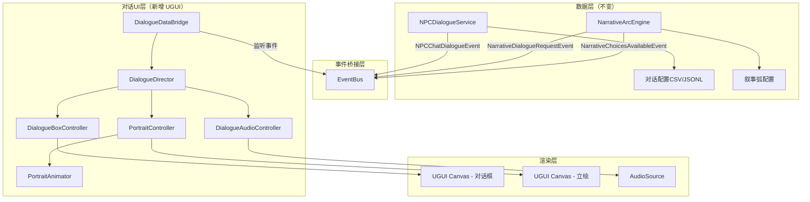

# 对话UI与立绘系统 — 构思文档

> **状态**：构思阶段  
> **技术选型**：UGUI（对话/立绘模块） + Spine 2D（立绘动态方案）  
> **与现有系统关系**：新增模块，不替换现有 UI Toolkit 面板

---

## 1. 现状分析

### 1.1 当前对话系统

| 组件 | 位置 | 技术 | 功能 |
|------|------|------|------|
| `NPCDialoguePanelController` | UI/Scripts/Social/ | UI Toolkit | NPC闲聊面板（打字机、选项分支、好感结算） |
| `DialogueBarController` | UI/Scripts/Core/Common/ | UI Toolkit | 底部简易对话条 |
| `NPCDialogueService` | Scripts/Social/ | 纯C# | 对话选取逻辑（条件过滤、加权随机、冷却） |
| `NarrativeDialogueRequestEvent` | Scripts/Gameplay/Narrative/ | EventBus事件 | 叙事弧引擎触发的对话请求 |

### 1.2 当前问题

- 现有对话面板只有**文字头像框**（取NPC名字首字），无立绘
- 无角色表情系统
- 无演出编排能力（立绘进出场、镜头、特效时序）
- 无音效层（对话气泡音、语气词、BGM切换）
- 叙事弧引擎的 `NarrativeDialogueRequestEvent` 目前无人监听

---

## 2. 设计目标

### 2.1 核心体验

```
玩家看到的不是"读文字"，而是"看一场演出"：
- 角色立绘滑入画面，带呼吸/微动
- 文字逐字显示，配合打字音效
- 表情随对话情绪切换（平静→惊讶→愤怒）
- 关键选择时立绘做出反应动画
- 对话结束立绘滑出，回到游戏世界
```

### 2.2 技术目标

| 目标 | 说明 |
|------|------|
| UGUI实现 | 对话/立绘模块全部用 UGUI，避免 UI Toolkit 对动画/Spine的限制 |
| 与现有数据流兼容 | 复用 EventBus + MarkDirty 模式，不破坏现有架构 |
| 配置驱动 | 对话演出指令写在配置中，AI可直接生成 |
| 渐进式立绘 | 基础版：静态图+表情切换；进阶版：Spine骨骼动画 |
| 与叙事弧引擎集成 | 监听 `NarrativeDialogueRequestEvent` 和 `NarrativeChoicesAvailableEvent` |

---

## 3. 架构设计

### 3.1 模块总览

```
Assets/Scripts/UI/Dialogue/          ← UGUI对话系统代码
├── DialogueUIManager.cs             ← 对话UI总管理器（UGUI版PanelBase）
├── DialogueBoxController.cs         ← 对话框控制（文字、名称、选项）
├── PortraitController.cs            ← 立绘控制器（位置、进出场、切换）
├── PortraitAnimator.cs              ← 立绘动画驱动（呼吸、表情、口型）
├── DialogueAudioController.cs       ← 对话音效控制
├── DialogueDirector.cs              ← 演出导演（编排时序）
└── DialogueDataBridge.cs            ← 数据桥接（EventBus↔对话UI）

Assets/Prefabs/UI/Dialogue/          ← UGUI Prefab
├── DialogueCanvas.prefab            ← 对话专用Canvas
├── DialogueBox.prefab               ← 对话框预制体
├── PortraitSlot_Left.prefab         ← 左侧立绘槽
└── PortraitSlot_Right.prefab        ← 右侧立绘槽

Assets/Resources/Portraits/          ← 立绘资源
├── Static/                          ← 静态立绘图集
│   ├── NPC_LiMing/
│   │   ├── normal.png
│   │   ├── happy.png
│   │   ├── angry.png
│   │   └── surprised.png
│   └── NPC_ZongMaster/
│       └── ...
└── Spine/                           ← Spine骨骼数据（进阶版）
    ├── NPC_LiMing/
    │   ├── skeleton.json
    │   ├── skeleton.atlas
    │   └── skeleton.png
    └── ...
```

### 3.2 分层架构



### 3.3 与现有 UI Toolkit 系统共存

```
┌─────────────────────────────────────────────────┐
│ Screen                                          │
│                                                 │
│  ┌─────────────────────────────────────────┐   │
│  │ UI Toolkit Layer (现有系统)              │   │
│  │  MainHUD / GameMenu / 背包 / 地图 等    │   │
│  └─────────────────────────────────────────┘   │
│                                                 │
│  ┌─────────────────────────────────────────┐   │
│  │ UGUI Dialogue Canvas (新增，Sort Order高)│   │
│  │  立绘 + 对话框 + 选项 + 特效            │   │
│  └─────────────────────────────────────────┘   │
│                                                 │
└─────────────────────────────────────────────────┘

共存方式：
- UGUI Canvas 的 Sort Order 设为 100+（高于 UI Toolkit 的 PanelSettings）
- 对话打开时通知 UIManager 暂停其他面板交互
- 对话关闭时恢复
```

---

## 4. 核心组件设计

### 4.1 DialogueDataBridge（数据桥接器）

```
职责：
- 监听 EventBus 中的对话相关事件
- 将事件数据转换为对话UI可消费的格式
- 管理对话队列（多个对话请求排队）
- 桥接叙事弧选择和对话选项

监听事件：
- NPCChatDialogueEvent → 普通NPC闲聊
- NarrativeDialogueRequestEvent → 叙事弧触发的剧情对话
- NarrativeChoicesAvailableEvent → 叙事弧选择展示

发布事件：
- DialogueStartedEvent → 通知其他系统对话开始
- DialogueEndedEvent → 通知其他系统对话结束
- DialogueChoiceMadeEvent → 玩家做出选择
```

### 4.2 DialogueDirector（演出导演）

```
职责：
- 解析对话配置中的演出指令
- 按时间轴编排：立绘进场 → 表情切换 → 文字开始 → 音效触发
- 管理演出状态机（Idle → Playing → WaitingChoice → Ending）

演出指令类型：
- portrait_enter: 立绘进场（方向、动画类型）
- portrait_exit: 立绘退场
- expression: 切换表情
- shake: 立绘震动（惊讶/愤怒）
- text: 显示文字（打字机速度、颜色）
- choice: 展示选项
- sfx: 播放音效
- bgm: 切换背景音乐
- wait: 等待N秒
- screen_effect: 屏幕特效（闪白、震动）
```

### 4.3 PortraitController（立绘控制器）

```
职责：
- 管理左右两个立绘槽位
- 控制立绘的进出场动画（滑入/淡入/弹入）
- 管理立绘的聚焦/失焦状态（说话者高亮，其他变暗）
- 切换立绘图片/Spine骨骼

接口抽象（IPortraitAnimator）：
- SetExpression(string expression)  → 设置表情
- PlayIdle()                        → 播放待机动画（呼吸）
- PlayTalk()                        → 播放说话动画（口型）
- PlayReaction(string reaction)     → 播放反应动画（震惊、点头）
- SetHighlight(bool active)         → 聚焦/失焦

实现类：
- StaticPortraitAnimator  → 静态图+表情图集切换+DOTween微动
- SpinePortraitAnimator   → Spine骨骼动画驱动（进阶版）
```

### 4.4 DialogueBoxController（对话框控制器）

```
职责：
- 打字机效果（逐字显示，可配速度）
- 名称显示
- 选项按钮生成和管理
- 点击继续/跳过打字机
- 富文本支持（颜色、加粗、抖动）

UI结构（UGUI）：
DialogueBox
├── NamePanel
│   └── NameText (TextMeshPro)
├── ContentPanel
│   └── ContentText (TextMeshPro)  ← 支持富文本
├── ChoicePanel
│   └── ChoiceButton_Template (动态生成)
├── ContinueIndicator (闪烁箭头)
└── SkipButton
```

### 4.5 DialogueAudioController（音效控制器）

```
职责：
- 打字音效（每N个字符播放一次，可配节奏）
- 角色语气词（"哼"、"嗯？"、"哈哈"等短音频片段）
- 情绪音效（惊讶SE、愤怒SE、感动SE）
- BGM切换/淡入淡出
- 环境音控制（对话时降低环境音量）

音效配置：
- 每个NPC可配独有的打字音色（男声低沉/女声清脆）
- 情绪音效跟随表情切换自动触发
- BGM切换由演出指令控制
```

---

## 5. 立绘方案详细设计

### 5.1 基础版：静态立绘 + 表情切换 + DOTween微动

```
实现方式：
- 每个NPC准备 4-8 张表情立绘（normal/happy/angry/surprised/sad/thinking）
- 用 Image 组件显示，切换时做 CrossFade
- DOTween 驱动呼吸动画（Scale Y 微微变化 0.98~1.02，周期2秒）
- DOTween 驱动说话动画（Scale 微微抖动）
- 进出场用 DOTween 的 Move + Fade

优点：
- 零额外依赖
- AI 可直接生成立绘图片
- 实现简单，1-2天可完成

资源规格：
- 分辨率：1024x1536（半身像）或 768x1024（胸像）
- 格式：PNG（透明背景）
- 命名：{NPCID}_{expression}.png
```

### 5.2 进阶版：Spine 2D 骨骼动画

```
实现方式：
- 每个NPC一套 Spine 骨骼数据
- 标准骨骼模板（头、身体、手臂、头发、衣服）
- 标准动画集（idle、talk、nod、shake、surprise、angry）
- 表情通过 Spine 的 Skin/Attachment 切换
- spine-unity Runtime 渲染到 SkeletonGraphic（UGUI兼容）

AI生产流程：
1. AI 生成角色设计图（正面全身）
2. 人工/半自动拆分为散件（头、身体、手臂、头发等）
3. 套入标准骨骼模板
4. 自动绑定标准动画集
5. 微调权重和物理参数

骨骼模板复用：
- 男性标准模板（适用大部分男性NPC）
- 女性标准模板（适用大部分女性NPC）
- 特殊体型模板（胖/矮/兽人等）
- 同一模板换皮肤图即可生成新角色

依赖：
- spine-unity Runtime（需购买 Spine Professional $349 一次性）
- Spine Editor（制作骨骼和动画）
```

### 5.3 渐进式落地策略

```
Phase 1（立即）：静态立绘 + DOTween
  → 先让对话系统跑起来，有基本的视觉表现
  → AI 生成立绘图片即可使用

Phase 2（后续）：接入 Spine
  → 为重要NPC制作 Spine 骨骼
  → 通过 IPortraitAnimator 接口无缝切换
  → 静态立绘和 Spine 立绘可以混用（次要NPC用静态，主要NPC用Spine）
```

---

## 6. 配置格式设计（AI友好）

### 6.1 对话演出配置（JSONL）

```jsonl
{"DialogueID":"DLG_LiMing_001","Speaker":"NPC_LiMing","Expression":"normal","Text":"恩公，好久不见了。","SFX":"voice_liming_greeting","PortraitEnter":"left_slide","Next":"DLG_LiMing_002"}
{"DialogueID":"DLG_LiMing_002","Speaker":"NPC_LiMing","Expression":"happy","Text":"上次多亏了你，我才能保住性命。","Next":"DLG_LiMing_003"}
{"DialogueID":"DLG_LiMing_003","Speaker":"NPC_LiMing","Expression":"thinking","Text":"对了，我最近听到一些消息...","Choices":[{"Text":"什么消息？","Next":"DLG_LiMing_004a"},{"Text":"不感兴趣","Next":"DLG_LiMing_004b"}]}
```

### 6.2 配置字段说明

| 字段 | 类型 | 说明 |
|------|------|------|
| DialogueID | string | 唯一ID |
| Speaker | string | 说话者NPC ID |
| Expression | string | 表情（normal/happy/angry/surprised/sad/thinking） |
| Text | string | 对话文本（支持富文本标签） |
| SFX | string | 音效ID（可选） |
| BGM | string | 切换BGM（可选） |
| PortraitEnter | string | 立绘进场方式（可选：left_slide/right_slide/fade） |
| PortraitExit | string | 立绘退场（可选） |
| ScreenEffect | string | 屏幕特效（可选：shake/flash） |
| Wait | float | 等待秒数（可选） |
| Next | string | 下一条对话ID |
| Choices | array | 选项列表（可选） |
| Condition | object | 显示条件（可选，复用叙事弧条件系统） |

---

## 7. 与现有系统集成

### 7.1 与 NPCDialoguePanelController 的关系

```
现有 NPCDialoguePanelController（UI Toolkit）：
  → 保留，用于简单NPC闲聊（无立绘、无演出）
  → 适合路人NPC、商人等功能性对话

新增 DialogueUIManager（UGUI）：
  → 用于剧情对话（有立绘、有演出、有选择）
  → 适合主线/支线剧情、叙事弧触发的对话
  → 监听 NarrativeDialogueRequestEvent

判断逻辑：
  if (对话有演出指令 || 来自叙事弧) → 新对话UI
  else → 现有NPC对话面板
```

### 7.2 与叙事弧引擎集成

```
叙事弧引擎 ActionExecutor 发布 dialogue 动作：
  → EventBus.Publish(NarrativeDialogueRequestEvent)
  → DialogueDataBridge 监听
  → 加载对应的对话演出配置
  → DialogueDirector 开始演出

叙事弧选择展示：
  → NarrativeChoicesAvailableEvent
  → DialogueDataBridge 监听
  → 在对话框中展示选项
  → 玩家选择后调用 NarrativeArcEngine.MakeChoice()
```

### 7.3 与 UIManager 共存

```csharp
// 对话开始时
DialogueUIManager.Open() {
    // 通知 UIManager 暂停交互
    EventBus.Publish(new DialogueStartedEvent());
    // UIManager 监听此事件，禁用其他面板的点击
    dialogueCanvas.sortingOrder = 100; // 确保在 UI Toolkit 之上
}

// 对话结束时
DialogueUIManager.Close() {
    EventBus.Publish(new DialogueEndedEvent());
    // UIManager 恢复其他面板交互
}
```

---

## 8. 音效设计

### 8.1 音效分层

| 层级 | 内容 | 触发方式 |
|------|------|----------|
| 打字音 | 每N字符一次的"嗒嗒"声 | 打字机自动触发 |
| 语气词 | NPC独有短音频（"哼"、"嗯"） | 配置中 SFX 字段 |
| 情绪SE | 惊讶/愤怒/感动等通用音效 | 表情切换时自动触发 |
| BGM | 背景音乐切换/淡入淡出 | 配置中 BGM 字段 |
| 环境音 | 对话时降低环境音量 | 对话开始/结束自动控制 |

### 8.2 打字音配置

```
每个NPC可配独有打字音色：
- 男性NPC：低沉"咚咚"
- 女性NPC：清脆"叮叮"
- 老者NPC：沙哑"沙沙"
- 默认：通用"嗒嗒"

节奏控制：
- 普通文字：每3个字符一次
- 标点符号：暂停0.2秒
- 省略号：暂停0.5秒
- 感叹号：音量+20%
```

---

## 9. 实施路径

### Phase 1：UGUI对话框架 + 静态立绘（优先）

```
1. 创建 DialogueCanvas Prefab（UGUI）
2. 实现 DialogueBoxController（打字机、选项、富文本）
3. 实现 PortraitController + StaticPortraitAnimator（静态图+DOTween）
4. 实现 DialogueDataBridge（EventBus桥接）
5. 实现 DialogueDirector（基础演出编排）
6. 集成到叙事弧引擎（监听 NarrativeDialogueRequestEvent）
7. 创建示例对话配置验证流程
```

### Phase 2：音效系统

```
1. 实现 DialogueAudioController
2. 打字音效 + 情绪SE
3. BGM切换集成
4. 环境音量控制
```

### Phase 3：Spine立绘接入

```
1. 引入 spine-unity Runtime
2. 实现 SpinePortraitAnimator（实现 IPortraitAnimator）
3. 制作标准骨骼模板（男/女）
4. 为主要NPC制作 Spine 数据
5. 混合模式：主要NPC用Spine，次要NPC用静态
```

---

## 10. 已确认决策

| 问题 | 决策 | 备注 |
|------|------|------|
| 对话风格 | **底部对话框式** | RPG风格，立绘在左右两侧，对话框在底部 |
| 立绘尺寸 | **半身像为主，尺寸不限死** | 通过配置控制每个NPC的立绘尺寸/位置偏移，默认半身 |
| 同屏立绘数量 | **左右各一个为主** | 支持左右两槽位，上限不硬编码，后续可扩展 |
| 旁白/内心独白 | **需要** | 无立绘的旁白模式，用于环境描写、内心独白、系统提示 |
| 对话回看 | **需要** | 对话历史记录，可回看已读对话 |
| 跳过功能 | **需要** | 快速跳过已看过的对话 |
| 自动播放 | **需要** | 自动推进对话模式（可开关） |

### 10.1 立绘尺寸配置方案

```
立绘尺寸不硬编码，通过 NPC 立绘配置表控制：

PortraitConfig:
  NPCID: string
  DefaultSize: Vector2      # 默认显示尺寸（像素）
  Pivot: Vector2            # 锚点（0.5, 0 = 底部居中）
  OffsetLeft: Vector2       # 在左槽位时的位置偏移
  OffsetRight: Vector2      # 在右槽位时的位置偏移
  Scale: float              # 缩放系数（1.0 = 原始大小）

这样不同NPC可以有不同的立绘表现：
- 高大角色：Scale 1.2，偏移向下
- 矮小角色：Scale 0.8，偏移向上
- 特殊演出：临时覆盖尺寸和位置
```

### 10.2 对话框布局确认

```
┌─────────────────────────────────────────────────────────┐
│                    游戏画面                               │
│                                                         │
│  ┌──────────┐                         ┌──────────┐     │
│  │          │                         │          │     │
│  │  左侧    │                         │  右侧    │     │
│  │  立绘    │                         │  立绘    │     │
│  │          │                         │          │     │
│  │          │                         │          │     │
│  └──────────┘                         └──────────┘     │
│                                                         │
│  ┌─────────────────────────────────────────────────┐   │
│  │ [名称]                                           │   │
│  │ 对话文本内容...                                   │   │
│  │                                                   │   │
│  │ [选项A]  [选项B]  [选项C]     [回看][自动][跳过] │   │
│  └─────────────────────────────────────────────────┘   │
└─────────────────────────────────────────────────────────┘

旁白模式：
┌─────────────────────────────────────────────────────────┐
│                    游戏画面                               │
│                                                         │
│                                                         │
│                                                         │
│  ┌─────────────────────────────────────────────────┐   │
│  │ [旁白]                                           │   │
│  │ 夜色渐深，远处传来阵阵钟声...                      │   │
│  │                                                   │   │
│  └─────────────────────────────────────────────────┘   │
└─────────────────────────────────────────────────────────┘
```
