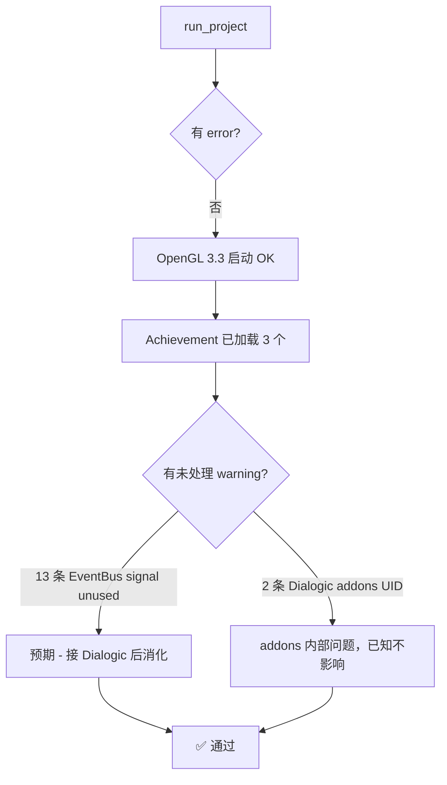

# 平台与分辨率方案

> **状态**：当前生效版本（2026-06-01 实施）
> **关联代码**：`project.godot`、`scenes/**/*.tscn`、`scripts/ui/Main.gd`、`resources/themes/main.tres`
> **执行结果**：✅ 已通过 `run_project` 自检，无 error，仅剩 EventBus 未接入引发的预期 warning

---

## 一、目标平台

| 平台 | 优先级 | 输出格式 | 状态 |
|------|--------|----------|------|
| **Windows Desktop** | P0 | `.exe`（嵌入 PCK） | 🟡 默认导出可用，待自定义图标 |
| **Android** | P0 | `.aab`（Google Play）+ `.apk`（侧载/分发） | 🔴 需安装 Android Build Template + JDK17 |
| **iOS** | P2 | `.ipa` | ⏸ 暂缓（需 macOS） |
| **HTML5 / Web** | P3 | WebGL2 | ⏸ 暂缓（仅 Demo 展示用） |

**渲染后端**：`gl_compatibility`（PC + 移动端共用）
- 选它的理由：低端 Android 兼容性最好；2D VN 不需要 Forward+/Mobile 的 PBR 能力
- 已在 [project.godot](../../project.godot) `[application] config/features` 中声明

---

## 二、分辨率与缩放

### 2.1 基准设计分辨率

```
viewport: 2560 × 1440 (2K, 16:9)
```

所有 UI、立绘、CG 都按此分辨率制作。

### 2.2 Stretch 策略

| 字段 | 值 | 含义 |
|------|----|----|
| `stretch/mode` | `canvas_items` | 矢量 UI 缩放清晰，文字不糊 |
| `stretch/aspect` | **`expand`** | 不锁宽高比，长屏手机长边露出更多画布而非黑边 |
| `stretch/scale` | `1.0` | 由系统按目标屏比例计算 |

**`expand` 的含义**：
- 16:9 设备（PC 主流、iPad）→ 完美 2560×1440 等比缩放
- 19.5:9 设备（iPhone 14）→ 短边铺满，**长边比基准多出约 280 px 画布**
- 4:3 设备（老 iPad）→ 长边铺满，短边比基准多出空间

**结论**：UI 必须用 **anchor 贴边布局**，不能写死 `offset`，否则长屏手机会留白。

### 2.3 开发窗口

```
window_width_override:  1600
window_height_override: 900
```

笔记本编辑器舒适（缩放 0.625），不影响发布。

### 2.4 HiDPI

```ini
window/dpi/allow_hidpi=true
```

在 4K 屏 PC 和高 DPI 手机上启用原生分辨率渲染，避免被系统缩放后糊化。

---

## 三、移动端配置

### 3.1 屏幕方向

```ini
window/handheld/orientation=0   ; 0 = Landscape（横屏锁定，允许左右翻转）
```

- 选横屏的理由：VN 全屏 CG + 底部对话框是横屏天生场景；竖屏会让 CG 上下出现大量黑边
- `0` 对应 Godot 4 的 `SCREEN_LANDSCAPE`，自动支持横屏左右翻转（手机倒过来不黑屏）

### 3.2 安全区适配

由 [Main.gd](../../scripts/ui/Main.gd) 的 `_apply_safe_area()` 在运行时处理：

```gdscript
func _apply_safe_area() -> void:
    var sa: Rect2i = DisplayServer.get_display_safe_area()
    var screen: Vector2i = DisplayServer.window_get_size()
    # 把 SceneRoot 收缩到安全区内，规避刘海/灵动岛/小白条
    _scene_root.offset_left = float(sa.position.x)
    _scene_root.offset_top = float(sa.position.y)
    _scene_root.offset_right = -float(screen.x - sa.end.x)
    _scene_root.offset_bottom = -float(screen.y - sa.end.y)
```

**触发时机**：`_ready()` 一次 + `get_tree().root.size_changed` 信号（屏幕方向翻转 / 调窗口）。

**关键依赖**：`Main.tscn` 的 `SceneRoot` 必须是 `Control`（已改），不能是 `Node`，否则 offset 不生效。

### 3.3 触屏热区

> Material Design：48×48 dp ≈ 96×96 px @2K
> iOS HIG：44×44 pt ≈ 88×88 px @2K

| 控件位置 | `custom_minimum_size` |
|----------|----------------------|
| 全屏中心按钮（标题菜单）| `(560, 96)` |
| 顶栏功能按钮（保存/跳过/返回）| `(160, 88)` |
| 选项按钮（对话选项）| `(>=600, 88)` |

---

## 四、渲染与纹理

### 4.1 纹理过滤（关键调整）

```ini
textures/canvas_textures/default_texture_filter=1   ; Linear（替代 Nearest=0）
```

**为什么改**：2K 资源缩到 720p（最低支持窗口）锯齿严重，linear 双线性过滤更柔和。
VN 不是像素游戏，无需保持 nearest。

### 4.2 纹理压缩格式

| 格式 | 用途 | 状态 |
|------|------|------|
| ETC2 / ASTC | Android、iOS（移动端 GPU 友好）| ✅ |
| S3TC / BPTC | PC（桌面 GPU 友好）| ✅ |

```ini
textures/vram_compression/import_etc2_astc=true
textures/vram_compression/import_s3tc_bptc=true
```

**代价**：导入耗时变长、安装包变大；**收益**：跨平台 GPU 解码零开销。

### 4.3 美术资源源分辨率约束

| 类型 | 推荐源分辨率 | 理由 |
|------|------------|------|
| **CG（全屏背景）** | **2560×1440 或更高** | 直接满铺基准 viewport |
| **角色立绘** | 高度 ≥ 1600 px | 缩放后头部不糊 |
| **UI 图标** | @2K 设计稿尺寸的 1× | 不需要 @2x，stretch 已处理 |
| **字体** | OTF 矢量 | 任何尺寸不糊 |

> ⚠️ 如果 CG 源只有 1080p，强行升 2K 只多耗内存、无视觉提升。**美术必须按 2K 出图**。

---

## 五、字号与字体规范（@2K 基准）

由 [resources/themes/main.tres](../../resources/themes/main.tres) 全局统一管控。

| 文字类别 | 字号（@2K）| 1080p 缩放 | iPhone 14 (812 高) 缩放 |
|----------|----------|----------|---------------------|
| 标题大字（"Disha"）| 120 | 90 | 68 |
| 章节/界面标题 | 48 | 36 | 27 |
| 对话内容（RichTextLabel）| **42** | 32 | 24 |
| 角色名 | 38 | 28 | 21 |
| 按钮文字 | 32 | 24 | 18 |
| 顶栏按钮文字 | 28 | 21 | 16 |
| 小字（时间戳）| 24 | 18 | 14 |

**字体**：默认 Godot 内置中文（占位）→ 待替换为思源宋体 SC Regular + Bold。
详见 [resources/fonts/README.md](../../resources/fonts/README.md)。

---

## 六、输入映射

| Action | PC 默认键 | 移动端等价 | 用途 |
|--------|----------|----------|------|
| `ui_advance` | 空格 / 鼠标左键 | 整屏点击 / Tap | 推进对话 |
| `ui_skip` | Ctrl | 顶栏"跳过"按钮 | 跳过 |
| `ui_quick_save` | F5 | 顶栏"保存"按钮 | 快速存档 |
| `ui_quick_load` | F6 | 读档界面 | 快速读档 |
| `ui_menu` | ESC | 顶栏汉堡按钮（待加）| 暂停菜单 |
| `ui_history` | Ctrl+H | Log 按钮 / 下滑（待加）| 历史记录 |
| `ui_auto` | A | 底栏"自动"按钮（待加）| 自动模式 |

> ⚠️ 纪律：**所有操作至少有一个屏幕可点击控件**，键盘只是 PC 加速器。

---

## 七、本次实施变更总览

| 文件 | 变更 |
|------|------|
| [project.godot](../../project.godot) | viewport 1920×1080 → **2560×1440**；新增 `aspect=expand` / `dpi/allow_hidpi` / `handheld/orientation`；`texture_filter` 0 → 1；启用 ETC2+S3TC；新增 `ui_menu/ui_history/ui_auto` 三个 action |
| [scenes/main/Main.tscn](../../scenes/main/Main.tscn) | `SceneRoot` 类型 `Node` → `Control`（全屏锚点）；ToastLabel 字号 22 → 36 |
| [scenes/title/TitleScreen.tscn](../../scenes/title/TitleScreen.tscn) | 标题字号 64 → 120；5 个菜单按钮 `(0,48)` → `(0,96)` + 字号 36；VBox 宽 280 → 560 |
| [scenes/dialogue/DialogueScene.tscn](../../scenes/dialogue/DialogueScene.tscn) | TopBar 三按钮 `(80,0)` → `(160,88)` + 字 28；DialogueBox 改用百分比锚点 `anchor_top=0.7`；Speaker 24 → 38；Content 默认 → 42；ChoiceBox 区域放大一倍 |
| [scenes/timeline/TimelineView.tscn](../../scenes/timeline/TimelineView.tscn) | 顶栏标题 28 → 48；返回按钮 `(80,0)` → `(160,88)`；Scroll 内距 40 → 80 |
| [scenes/achievement/AchievementPanel.tscn](../../scenes/achievement/AchievementPanel.tscn) | 同 TimelineView；Stat 字号 18 → 28 |
| [scripts/ui/Main.gd](../../scripts/ui/Main.gd) | `_scene_root` 类型 `Node` → `Control`；新增 `_apply_safe_area()` 函数；删除未用 `_toast_layer` 变量 |
| [resources/themes/main.tres](../../resources/themes/main.tres) | **新建**：默认字号 32 / 正文 36 的全局 Theme |
| [resources/fonts/README.md](../../resources/fonts/README.md) | **新建**：字体下载源（思源宋体 SC）+ 接入流程 |

---

## 八、运行时校验



---

## 九、待办（按优先级）

### P0
1. **接 Dialogic + 跑通第一帧**：建 `data/timelines/test_first.dtl`，改 `DialogueScene.gd` 调 `Dialogic.start()`
2. 真机测试：确认 Android Build Template 是否安装；调试横屏 + 安全区效果

### P1
3. 放思源宋体 OTF 文件，更新 `main.tres` 加 `default_font` 引用
4. 给 `Theme` 加 Button 默认 StyleBox（圆角、悬停态、按下态）
5. 加 ESC / 汉堡菜单 → 暂停面板（ui_menu 已绑）
6. 读档界面（TitleScreen 的 `_on_load` 还是 TODO）

### P2
7. CG 系统接 EventBus.cg_shown 信号
8. Settings 界面（音量、文字速度、自动间隔）
9. Web 导出预设
10. iOS 导出预设（需要 Mac）
