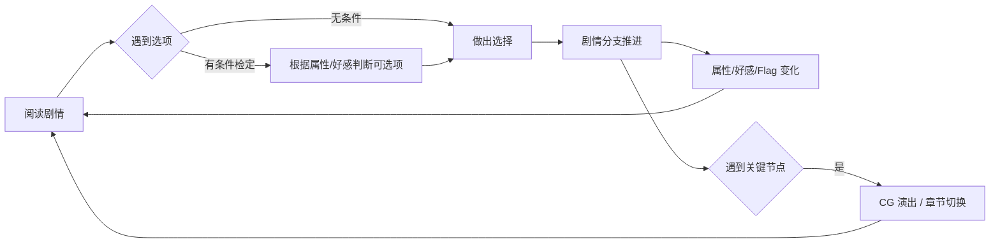

# 玩法范围与边界

> **状态**：当前生效版本（2026-06-01 拟定）
> **关联文档**：[01-平台与分辨率](./01-平台与分辨率.md) · [03-技术栈与架构](./03-技术栈与架构.md) · [04-属性·好感·检定系统设计](./04-属性·好感·检定系统设计.md)
> **目的**：本文档定义"做什么、不做什么"——是后续所有技术决策的边界。

---

## 一、产品定性

| 维度 | 定位 |
|------|------|
| **类型** | 视觉小说（Visual Novel）+ 选项分支系统 |
| **题材** | 中国志怪 · 唐末乱世 · 侠义 |
| **风格基调** | 沉重而非热血、悲悯而非爽感、留白而非说教 |
| **参考坐标** | 《极乐迪斯科》（属性检定）+《天命奇御》（侠义调性）+《十三机兵防卫圈》（多线叙事）|
| **目标体量（首发版本）** | 序章 + 第一章可玩 Demo（约 2~3 小时流程） |
| **目标体量（完整版）** | 序章 + 3 章主线，约 12~15 小时流程，3 个主结局 |

> **不做的事**：不是 RPG、不是开放世界、不是即时战斗。所有"战斗"通过文字+检定+CG 演出完成，不实现任何战斗系统。

---

## 二、核心循环

### 2.1 玩家在做什么



### 2.2 一个典型 5 分钟体验切片

```
[CG: 越州城夜景]
    旁白："夜风穿过破败的牌坊……"
[立绘进场: 老道士]
    老道士："小友，你身上有黄皮书的气息。"
[选项]
    ▸ "你怎么知道？"           （无条件）
    ▸ "拔剑相向"               （需要 武力 ≥ 3）
    ▸ "用『地煞之眼』观察他"    （需要 智略 ≥ 2，未达成显示灰色）
[玩家选择 → 剧情分支]
    → 武力路线：动手 → 老道士反制 → 学到"以柔克刚" → 智略+1
    → 观察路线：发现老道士真身 → 解锁隐藏对话 → 好感+10
[继续阅读 → 下一个节点]
```

---

## 三、主线骨架（继承自旧需求 v2.0，未变）

### 3.1 章节结构

| 章节 | 名称 | 黄皮书目标 | 主要场景 | 推进条件 |
|------|------|-----------|---------|---------|
| **序章** | 初入乱世 | 画皮鬼（必败） | 江南偏远村落 | 必败逃脱 → 自动推进 |
| **第一章** | 画皮鬼 | 画皮鬼（强化版） | 越州城及周边 | 调查权贵失踪 → 战胜画皮鬼 → 拾得"造化丹残留" |
| **第二章** | 千佛寺 | 千佛寺 Boss | 千佛寺及地下工坊 | 揭破活人炼丹 → 战胜 Boss → 京城获国师遗信 |
| **第三章** | 太平篇 | 国师残留意志 | 国师故乡旧址（盛唐幻境） | 揭破真相 → 最终抉择 → 进入结局 |

### 3.2 黄皮书机制（玩家任务追踪）

- 黄皮书是主角随身携带的**目标提示册**
- 每章固定显示当前章节的"黄皮书目标"
- 击败/达成目标 → 黄皮书自动翻页 → 进入下一章
- **不做支线任务追踪**（支线靠剧情上下文，不进黄皮书）

### 3.3 多结局（v2.0 设计延续）

| 结局 ID | 触发条件 | 结局基调 |
|--------|---------|---------|
| `END_BREAK_DREAM` | 终章选择"打破幻境" | 决绝 |
| `END_KEEP_DREAM` | 终章选择"保留幻境" | 妥协 |
| `END_PEACEFUL_REST` | 完成燕行烈全支线 + 关键好感门槛 | 释怀（最优解） |

> **注**：结局数量首发可减为 3 个（上表），后续再扩展隐藏结局。

---

## 四、核心 NPC 范围

| NPC | 角色 | 出现章节 | 是否记录好感 |
|-----|------|---------|-------------|
| **燕行烈** | 主要伴随 NPC、国师师弟、地府鬼差 | 1~3 章 | ✅ |
| **导师**（类似刘老道）| 序章引路人、剧情顾问 | 序章~3 章 | ✅ |
| **国师**（女）| 终章核心人物（已逝） | 3 章 | ❌（追忆视角，无交互）|
| **黄角式信众首领** | 白莲教雏形、温暖支线 | 1~2 章野外 | ✅ |
| **路人 NPC** | 城镇/委托提供者 | 各章 | ❌ |

> **首发只完整实现燕行烈 + 导师两个 NPC 的好感线**，其他可后续扩展。

---

## 五、做与不做（明确边界）

### 5.1 ✅ 必做（首发 Demo 必须有）

| 系统 | 范围 |
|------|------|
| **对话引擎** | 基于 Dialogic 2，支持立绘、表情、台词、选项 |
| **三属性系统** | 武力 / 侠义 / 智略，半显性（剧情中提示 "+1"，无面板）|
| **好感度系统** | 0~100 内部数值，不可见，仅用于触发条件 |
| **门槛检定** | 选项前置条件不达标 → 显示灰色不可选，**无骰子、无概率**|
| **存档系统** | 至少支持自动存档 + 1 个手动存档槽 |
| **CG 系统** | 全屏 CG 显示与切换（接 EventBus.cg_shown 信号）|
| **设置面板** | 文字速度、BGM 音量、SE 音量、自动间隔 |
| **历史记录（Backlog）** | 回看已读对话 |
| **多语言预留** | 资源走 `tr()`，但首发只出中文 |

### 5.2 ❌ 不做（首发明确放弃）

| 不做 | 理由 |
|------|------|
| ❌ 即时战斗 / 回合战斗 | 战斗用"检定 + CG + 文字"演出代替 |
| ❌ 自由探索地图 | VN 体裁，不需要走格子或 2D 移动 |
| ❌ 任务清单 / 委托管理 | 用黄皮书代替，避免"任务管理负担"|
| ❌ 道具 / 背包系统 | 关键道具直接走 Flag（"已获得造化丹残留"= bool）|
| ❌ 经济 / 货币 | 不需要 |
| ❌ 修真境界 | 已废弃（v1.0 旧设计） |
| ❌ 声望系统 | 用 NPC 好感度 + 三属性代替 |
| ❌ 程序化生成 NPC | 所有 NPC 手工配置 |
| ❌ 联机 / 社交 | 单机视觉小说 |
| ❌ 配音（语音） | 首发不配音；预留接口（Dialogic 支持），后续视情况 |

### 5.3 🟡 后置（先不做，但保留接口）

| 系统 | 何时引入 |
|------|---------|
| 🟡 显性属性面板 | 玩家需求强烈再开 |
| 🟡 成就系统 | 第一章后接入 |
| 🟡 隐藏结局（END_PEACEFUL_REST 已规划） | 第三章实现时同步 |
| 🟡 配音 | 全篇剧本定稿后再考虑 |
| 🟡 Web / iOS 导出 | PC + Android 稳定后 |

---

## 六、关键概念表（给合作者看的术语对照）

| 中文术语 | 内部代码标识 | 解释 |
|---------|------------|------|
| 黄皮书 | `huangbook` | 玩家的章节目标提示册（剧情道具，非系统） |
| 三属性 | `attr_wuli` / `attr_xiayi` / `attr_zhilue` | 武力 / 侠义 / 智略 |
| 好感度 | `affinity[npc_id]` | NPC 好感度，0~100 整数 |
| 门槛检定 | `requirement` | 选项前置条件，不达标→灰色 |
| 剧情标志 | `flag_*` | 一次性事件标记，bool 类型 |
| 时间线 | Dialogic Timeline / `.dtl` | Dialogic 2 的剧本文件 |
| 序章必败战 | `must_lose_battle` | 用文字+CG 演出失败逃脱，无战斗系统 |
| 通幽 | （仅剧情设定）| 故事中"看见非人之物"的能力，**不是玩法系统**|
| 造化丹 | （剧情道具）| 主线核心暗线物品，玩家无法使用 |
| 盛唐幻境 | （3 章场景）| 国师执念造就的幻境，制造尸潮的根源 |

---

## 七、变更日志

| 日期 | 版本 | 变更 |
|------|------|------|
| 2026-04-02 | v1.0 | 旧设计（5 章 + 修真境界），已废弃 |
| 2026-05-31 | v2.0 | 重构：唐末乱世 + 序章+3 章志怪主线 |
| 2026-06-01 | v3.0 | **本版**：迁移 Godot；引入三属性 + 好感度 + 门槛检定；明确"不做战斗系统"边界 |
