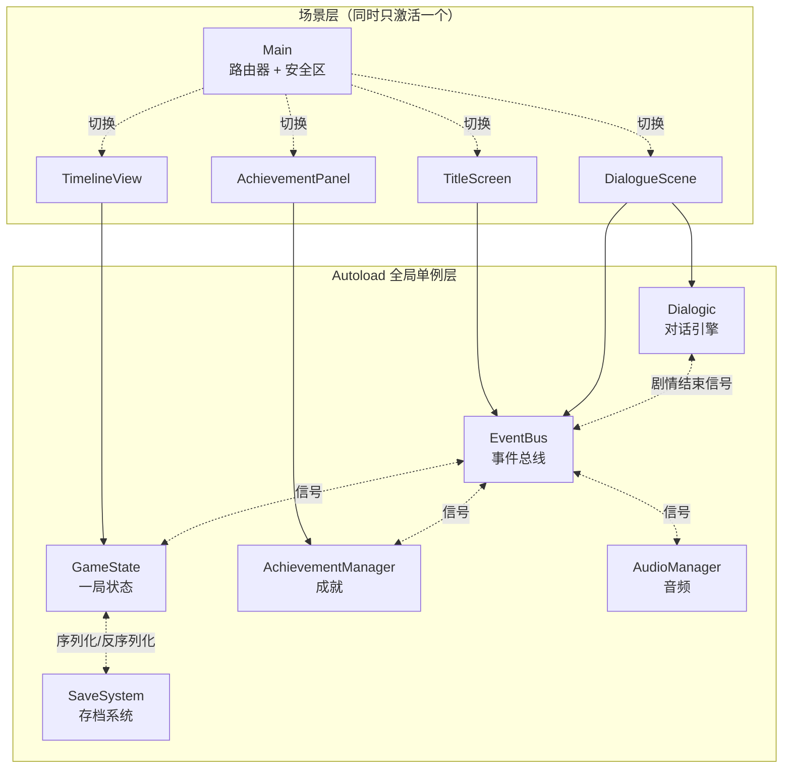
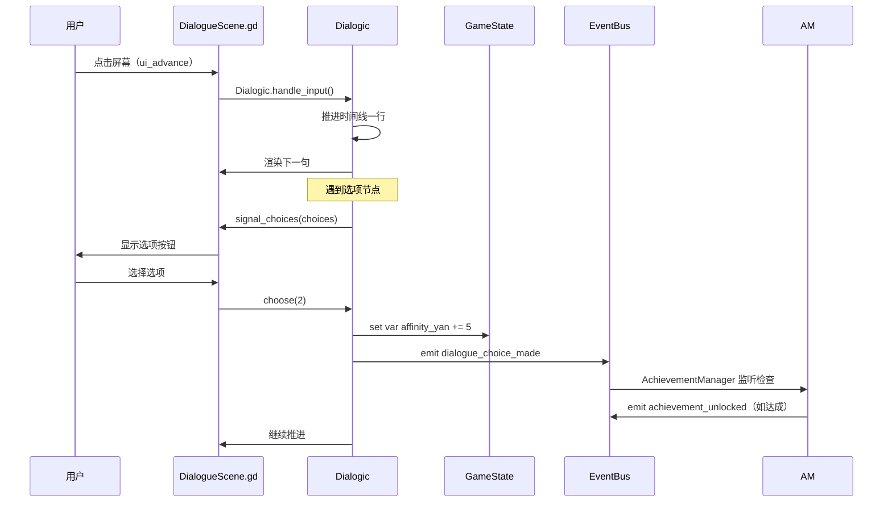
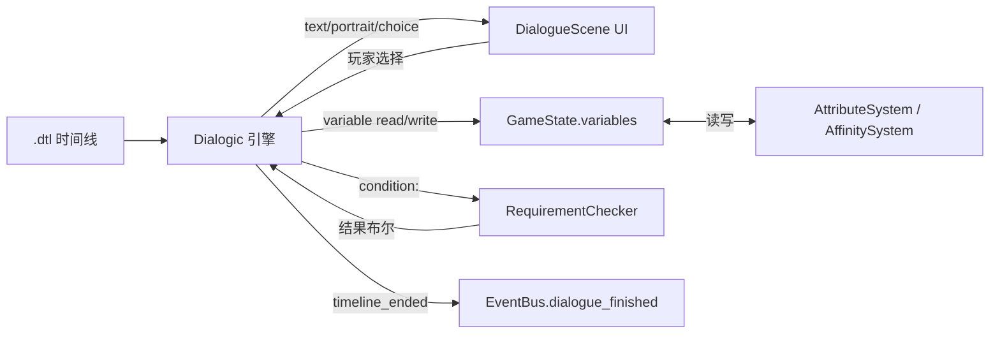

# 技术栈与架构

> **状态**：当前生效版本（2026-06-01 制定）
> **关联代码**：[project.godot](../../project.godot) · [scripts/autoload/](../../scripts/autoload/) · [addons/dialogic/](../../addons/dialogic/)
> **关联文档**：[01-平台与分辨率](./01-平台与分辨率.md) · [02-玩法范围与边界](./02-玩法范围与边界.md)

---

## 一、技术选型

### 1.1 核心技术栈

| 层级 | 选型 | 版本 | 用途 |
|------|------|------|------|
| 引擎 | **Godot Engine** | 4.6.x | 跨平台 2D 游戏引擎 |
| 脚本语言 | **GDScript** | Godot 内置 | 主要游戏逻辑（首选）|
| 渲染后端 | `gl_compatibility` | OpenGL 3.3 / GLES3 | 跨平台兼容（PC + 移动）|
| 对话引擎 | **Dialogic 2** | 2.x（已装于 `addons/dialogic/`）| 时间线、立绘、表情、本地化 |
| 数据格式 | JSON / `.tres`（Godot 资源）/ `.dtl`（Dialogic 时间线）| — | 配置/存档/对话脚本 |
| UI | Godot **Control 节点** + Theme | 引擎原生 | 全部 UI 都用 Control |

### 1.2 为什么是 Godot 4.6 + Dialogic 2

| 决策 | 替代方案 | 选定理由 |
|------|---------|---------|
| **Godot vs Unity** | Unity / Unreal | 开源、轻量、对 2D VN 友好、跨平台导出零依赖；不需要 C# 工具链 |
| **Dialogic vs 自研对话引擎** | 从零写一套 | Dialogic 已支持时间线编辑器、立绘、表情、变量、条件、本地化、存档接口——避免重复造轮子 |
| **GDScript vs C#** | C#（Godot 也支持）| 编辑器内热重载、无 Mono 依赖、社区配方多；性能不敏感（VN 不需要）|

### 1.3 不使用什么（明确清单）

- ❌ 不用 C# / .NET
- ❌ 不用 Unity 时代的任何 C# 类型（`PanelBase` / `NarrativeArcEngine` 等已归档）
- ❌ 不用 UI Toolkit（Unity 的概念，Godot 没有）
- ❌ 不用 RichTextLabel 以外的富文本方案（Dialogic 已封装）
- ❌ 不用第三方状态机插件（Dialogic Timeline + 自研 GameState 已够用）

---

## 二、项目目录结构

```
Disha/
├── project.godot              ← Godot 工程配置（Autoload / 输入 / 渲染）
├── icon.svg                   ← 引擎默认图标（待替换）
│
├── addons/
│   └── dialogic/              ← Dialogic 2 插件（不要手动改这里）
│
├── scenes/                    ← 场景文件 .tscn
│   ├── main/Main.tscn         ← 入口场景（路由器 + 安全区适配）
│   ├── title/TitleScreen.tscn ← 标题界面
│   ├── dialogue/DialogueScene.tscn  ← 对话主场景（接 Dialogic）
│   ├── timeline/TimelineView.tscn   ← 故事节点回顾界面
│   └── achievement/AchievementPanel.tscn ← 成就面板
│
├── scripts/                   ← GDScript 代码
│   ├── autoload/              ← 全局单例（5 个）
│   │   ├── EventBus.gd        ← 事件总线
│   │   ├── GameState.gd       ← 一局状态（变量/Flag/解锁节点）
│   │   ├── SaveSystem.gd      ← 存档读写
│   │   ├── AchievementManager.gd  ← 成就解锁
│   │   └── AudioManager.gd    ← 音频（BGM / SE）
│   ├── ui/                    ← 各场景对应的控制器脚本
│   │   ├── Main.gd
│   │   ├── TitleScreen.gd
│   │   ├── DialogueScene.gd
│   │   ├── TimelineView.gd
│   │   └── AchievementPanel.gd
│   ├── systems/               ← 业务子系统（属性/检定等，待建）
│   └── data/                  ← 数据访问层（待建）
│
├── data/                      ← 配置与剧本数据
│   ├── achievements/achievements.json   ← 成就定义
│   ├── timeline/story_nodes.json        ← 故事节点配置
│   └── timelines/                       ← Dialogic 时间线 .dtl
│       └── test.dtl
│
├── resources/                 ← 美术与主题
│   ├── audio/{bgm,sfx}/       ← 音频
│   ├── cgs/                   ← CG 立绘背景
│   ├── dialogues/             ← Dialogic 角色资源 .dch
│   ├── fonts/                 ← 字体
│   └── themes/main.tres       ← 全局 UI Theme
│
└── docs/                      ← 文档（你正在看的这个）
```

> **目录约定**：
> - 编辑器的 `folder_colors`（见 [project.godot](../../project.godot)）已为 `addons/灰`、`data/黄`、`resources/紫`、`scenes/蓝`、`scripts/绿`，便于在编辑器中快速识别。

---

## 三、运行时架构

### 3.1 总体架构图



### 3.2 关键设计模式

| 模式 | 应用 |
|------|------|
| **事件总线（Pub/Sub）** | `EventBus.gd` 全局信号集中声明，模块间不直接引用 |
| **单例（Autoload）** | 5 个 Autoload + Dialogic 提供全局服务 |
| **场景路由** | `Main.gd` 监听 `EventBus.request_scene_change` 切换场景 |
| **数据驱动** | 剧情走 `.dtl`、成就走 JSON、属性走 `GameState.variables`（无硬编码）|
| **关注点分离** | UI 脚本只管显示；逻辑放 `scripts/systems/`；数据放 `scripts/data/` |

### 3.3 一次"对话推进"的调用流（参考实现）



---

## 四、Autoload 单例职责

### 4.1 EventBus.gd ——"模块间唯一通信渠道"

**已声明的信号清单**（见 [scripts/autoload/EventBus.gd](../../scripts/autoload/EventBus.gd)）：

| 类别 | 信号 | 触发方 |
|------|------|--------|
| 对话 | `dialogue_started(id)` | DialogueScene |
| 对话 | `dialogue_finished(id)` | DialogueScene / Dialogic timeline_ended |
| 对话 | `dialogue_choice_made(id, idx)` | DialogueScene |
| CG | `cg_shown(id)` / `cg_hidden(id)` | DialogueScene 或 Timeline 触发器 |
| 进度 | `story_node_unlocked(id)` | GameState.unlock_story_node |
| 进度 | `flag_changed(name, value)` | GameState.set_flag |
| 成就 | `achievement_unlocked(id)` | AchievementManager |
| 存档 | `save_completed(slot)` / `load_completed(slot)` | SaveSystem |
| 路由 | `request_scene_change(path)` | 任意场景 → Main 监听 |
| UI | `request_toast(text, duration)` | 任意 → Main 监听 |

**新增信号原则**：
- 信号必须有强类型签名
- 在 `EventBus.gd` 集中声明，不允许在子模块中私自定义全局信号
- 命名规范：`<领域>_<动作>` 过去时（已发生事件）或 `request_<动作>`（请求事件）

### 4.2 GameState.gd ——"一局游戏的所有状态"

**字段（见 [scripts/autoload/GameState.gd](../../scripts/autoload/GameState.gd)）**：

| 字段 | 类型 | 用途 |
|------|------|------|
| `variables` | Dictionary | 玩家变量（**三属性、好感度都进这里**——见 04 文档）|
| `flags` | Dictionary | 一次性事件标记（bool/int/String）|
| `unlocked_story_nodes` | Array[String] | TimelineView 用的解锁节点列表 |
| `current_dialogue_id` | String | 当前对话 ID |
| `current_cg_id` | String | 当前 CG ID |
| `play_time_seconds` | float | 累计游玩时长 |

**核心 API**：
```gdscript
GameState.set_flag("met_yan_xinglie", true)      # 写 Flag
GameState.has_flag("met_yan_xinglie")            # 查 Flag
GameState.unlock_story_node("ch01_intro")        # 解锁节点
GameState.to_dict() / from_dict(d)               # 序列化（供 SaveSystem）
GameState.reset_to_new_game()                    # 新游戏重置
```

**纪律**：
- 任何"会被存档"的状态**只能**放 GameState
- 子系统（属性、好感、检定）**不应**自己存数据，而是统一存到 `GameState.variables`

### 4.3 SaveSystem.gd ——"存档的唯一入口"

- 写档：序列化 `GameState.to_dict()` + Dialogic 状态 → JSON → `user://saves/slot_N.json`
- 读档：JSON → `GameState.from_dict()` + Dialogic 恢复
- 自动存档：在每次 `dialogue_finished` 信号后写入 `slot_auto`

### 4.4 AchievementManager.gd ——"成就的唯一管理者"

- 启动时从 `data/achievements/achievements.json` 加载定义
- 监听 `EventBus` 的 `flag_changed` / `dialogue_finished` / `story_node_unlocked` 等
- 满足条件 → emit `achievement_unlocked`
- 解锁状态写入 `user://achievements.json`（独立于存档槽）

### 4.5 AudioManager.gd ——"音频统一调度"

- BGM 淡入淡出
- SE 一次性触发（按钮点击、翻页）
- 监听 `EventBus.cg_shown` 等触发音乐切换

### 4.6 Dialogic（addon 自带 Autoload）

- 全局可用 `Dialogic.start("timeline_id")`
- 提供 `timeline_ended` / `signal_event` 等信号
- **不要**直接修改 `addons/dialogic/`，所有自定义都通过监听信号 + 修改 Layout

---

## 五、剧情驱动方案：Dialogic + 自研补充

### 5.1 用 Dialogic 提供（开箱即用）

| 能力 | Dialogic 模块 |
|------|--------------|
| 时间线编辑器 | TimelineEditor |
| 角色与立绘 | Character + LayeredPortrait |
| 选项分支 | Choice |
| 条件判断 | Condition |
| 跳转 | Jump |
| 变量 | Variable |
| 历史 | History |
| 存档接口 | Save 模块（被 SaveSystem 包装） |
| 文本特效 | Text + bbcode_transitions |

### 5.2 我们补充什么（自研）

| 模块 | 文件位置 | 职责 |
|------|---------|------|
| **属性系统** | `scripts/systems/AttributeSystem.gd`（待建）| 武力/侠义/智略增减、变更广播 |
| **好感度系统** | `scripts/systems/AffinitySystem.gd`（待建）| NPC 好感度增减、阈值事件 |
| **门槛检定** | `scripts/systems/RequirementChecker.gd`（待建）| 评估选项前置条件，输出"可选/灰色"|
| **黄皮书 UI** | `scripts/ui/HuangBookHud.gd`（待建）| 章节目标显示 |
| **存档槽 UI** | `scripts/ui/SaveLoadPanel.gd`（待建）| 多槽位界面 |

> **以上 5 项在 04 / 05 文档中详细设计**。

### 5.3 Dialogic 与自研系统的接合点



**约定**：
- 在 `.dtl` 中读写 `{变量名}` → 实际指向 `GameState.variables[变量名]`
- 选项的 `条件` 字段 → 调 `RequirementChecker.check(req_id)` 返回 bool

---

## 六、编码规范（GDScript）

| 规则 | 示例 |
|------|------|
| 类型注解必填 | `func add(a: int, b: int) -> int:` |
| 文件头注释（`##` 双井）| 每个 Autoload / 子系统都要写"职责一句话" |
| 信号命名 | 过去时（`dialogue_finished`）或 `request_*` |
| 私有字段 | 下划线前缀 `_my_field` |
| 常量大写蛇形 | `const MAX_AFFINITY := 100` |
| 缩进 | 真制表符（Godot 默认）|
| 字符串 | 双引号优先 |

---

## 七、变更日志

| 日期 | 版本 | 变更 |
|------|------|------|
| 2026-06-01 | v1.0 | 初版：从 Unity（C# + UGUI）迁移到 Godot 4.6（GDScript + Dialogic 2）后的首份架构文档 |
