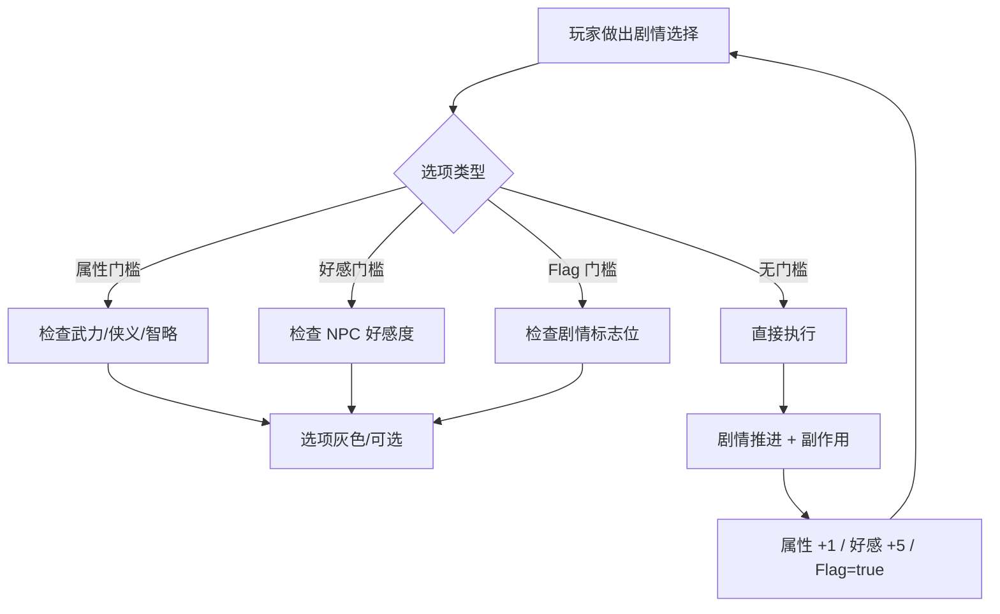

# 属性 · 好感 · 检定系统设计

> **状态**：当前生效版本（2026-06-01 制定）
> **关联代码**：[scripts/autoload/GameState.gd](../../scripts/autoload/GameState.gd) · `scripts/systems/`（待建）
> **关联文档**：[02-玩法范围与边界](./02-玩法范围与边界.md) · [03-技术栈与架构](./03-技术栈与架构.md)
> **核心决策**：三属性 + 0~100 内部好感度 + 门槛式检定（无骰子、无概率、无 GameOver）

---

## 一、设计总则

### 1.1 玩法定位（不要忘了边界）

- **不是 RPG**：没有等级、没有装备、没有数值面板
- **不是骰子游戏**：检定不掷骰子，也不计算概率
- **是叙事游戏**：所有数值的存在意义都是"让玩家的选择不同 → 看到不同的故事"

### 1.2 三个核心数值的关系



---

## 二、三属性系统

### 2.1 属性定义

| 属性 ID | 中文名 | 含义 | 增加来源举例 |
|---------|--------|------|-------------|
| `attr_wuli` | **武力** | 战斗、武艺、镇压力 | 选择正面对决、习武、护送 |
| `attr_xiayi` | **侠义** | 见义勇为、底层立场、人情味 | 救助百姓、违令救人、对弱者的善意 |
| `attr_zhilue` | **智略** | 推理、调查、识破诡计 | 选择观察、推断、识破谎言 |

### 2.2 数值范围与初始值

| 项目 | 值 |
|------|----|
| 初始值（新游戏）| 各属性 0 |
| 取值范围 | 0 ~ 99（无硬上限，但门槛设计不超过 15）|
| 数据类型 | int |
| 显示形式 | **半显性**：剧情中以 toast 形式提示 `武力 +1`，**不提供属性面板**|

> **半显性的意思**：玩家"知道有属性、知道刚加了一点"，但不知道当前总值。这避免了"刷数值"的诱惑，但又给玩家选择反馈。

### 2.3 涨点频率（剧情节奏）

| 章节 | 总加点预算（建议）|
|------|------------------|
| 序章 | 2~3 点（教学）|
| 第一章 | 4~6 点 |
| 第二章 | 4~6 点 |
| 第三章 | 2~4 点（叙事高潮，少加点）|
| **完整通关总加点** | 约 **12~19 点** |

> 设计原则：**任何路线都不应该把单属性堆到 15 以上**——避免最终选项变成"只看一项属性"。

### 2.4 数据存储

存放于 `GameState.variables`：

```gdscript
# 新游戏初始化时
GameState.variables["attr_wuli"] = 0
GameState.variables["attr_xiayi"] = 0
GameState.variables["attr_zhilue"] = 0
```

> **不要在自己的子系统里另开一份数据**——所有可存档状态必须走 `GameState`。

### 2.5 子系统 API（待实现 `scripts/systems/AttributeSystem.gd`）

```gdscript
class_name AttributeSystem
extends Node

## 增加属性值，并发出 toast 提示
static func add(attr_id: String, delta: int, silent: bool = false) -> void:
    var old: int = GameState.variables.get(attr_id, 0)
    var new_val: int = old + delta
    GameState.variables[attr_id] = new_val
    if not silent and delta != 0:
        EventBus.request_toast.emit(_format_toast(attr_id, delta), 2.0)

static func get_value(attr_id: String) -> int:
    return GameState.variables.get(attr_id, 0)

static func _format_toast(attr_id: String, delta: int) -> String:
    var name := {"attr_wuli": "武力", "attr_xiayi": "侠义", "attr_zhilue": "智略"}.get(attr_id, attr_id)
    var sign := "+" if delta > 0 else ""
    return "%s %s%d" % [name, sign, delta]
```

---

## 三、NPC 好感度系统

### 3.1 好感度定义

| 项目 | 设计 |
|------|------|
| 数值范围 | **0 ~ 100**（int） |
| 初始值 | 全部 NPC = 0（首次相遇时初始化）|
| 显示 | **完全不可见**——玩家永远看不到具体数值 |
| 反馈 | 仅在剧情对话中通过 NPC 的语气/态度暗示 |
| 数据存储 | `GameState.variables["affinity_<npc_id>"]` |

### 3.2 NPC 清单（首发）

| NPC ID | 中文名 | 出场章节 | 设计意图 |
|--------|--------|---------|---------|
| `yan_xinglie` | 燕行烈 | 1~3 章 | 主线情感支柱，影响 END_PEACEFUL_REST 触发 |
| `daoist_master` | 导师（老道士）| 序~3 章 | 复习剧情、解锁支线对话 |
| `huangjiao_leader` | 黄角式信众首领 | 1~2 章 | 温暖支线、白莲教雏形伏笔 |

> 其他 NPC（路人、委托人）**不记好感度**，避免过载。

### 3.3 好感度阈值（语义档位）

虽然内部是 0~100 数值，但策划写剧情时按这 5 档思考：

| 内部数值 | 档位 | 含义 |
|---------|------|------|
| 0 ~ 19 | 陌生 | 初次见面或敌对 |
| 20 ~ 39 | 认识 | 知道彼此但无情谊 |
| 40 ~ 59 | 朋友 | 愿意合作 |
| 60 ~ 79 | 挚友 | 关键时刻支援 |
| 80 ~ 100 | 莫逆 | 解锁特殊剧情/隐藏结局 |

### 3.4 子系统 API（待实现 `scripts/systems/AffinitySystem.gd`）

```gdscript
class_name AffinitySystem
extends Node

const KEY_PREFIX := "affinity_"
const MIN_AFFINITY := 0
const MAX_AFFINITY := 100

static func add(npc_id: String, delta: int) -> void:
    var key := KEY_PREFIX + npc_id
    var old: int = GameState.variables.get(key, 0)
    var new_val: int = clampi(old + delta, MIN_AFFINITY, MAX_AFFINITY)
    GameState.variables[key] = new_val
    # 注意：好感度变化不弹 toast，避免破坏沉浸

static func get_value(npc_id: String) -> int:
    return GameState.variables.get(KEY_PREFIX + npc_id, 0)

static func is_at_least(npc_id: String, threshold: int) -> bool:
    return get_value(npc_id) >= threshold
```

---

## 四、门槛检定系统

### 4.1 设计哲学

> "**够格才能选，不够格的连尝试都不让你尝试。**"

- 不掷骰子、不算概率、不存在"运气好失败/运气坏成功"
- 选项前置条件不达标 → **显示为灰色不可选**（仍然可见，让玩家知道存在另一条路）
- 这能让玩家明确感知"我的属性培养方向决定了我能走的路线"

### 4.2 检定的 5 种条件类型

| 类型 | 数据形式 | 示例 |
|------|---------|------|
| 属性 ≥ 阈值 | `attr_wuli >= 5` | 拔剑相向 |
| 好感度 ≥ 阈值 | `affinity_yan_xinglie >= 60` | 求燕行烈相助 |
| Flag 为真 | `flag:met_master` | 引用导师身份 |
| Flag 为假 | `!flag:lied_to_yan` | 没说过谎才能… |
| 复合（AND/OR）| 多条件组合 | 武力≥3 且 好感≥40 |

### 4.3 选项设计三原则

1. **任何路线都至少有一个无门槛选项可走**——不能让玩家卡死
2. **门槛选项必须显示**（灰色），不能隐藏——让玩家看到"我错过了什么"
3. **检定失败不存在**——你只会看到"是否可选"，没有"试了一下失败了"

### 4.4 数据格式约定（在 .dtl 中如何写）

Dialogic 的 Choice 事件原生支持 `condition` 字段。我们规范写法如下：

```
- text: "拔剑相向"
  condition: "{attr_wuli} >= 5"
  action: "AttributeSystem.add('attr_wuli', 1)"

- text: "用『地煞之眼』观察他"
  condition: "{attr_zhilue} >= 2"
  action: "AttributeSystem.add('attr_zhilue', 1); AffinitySystem.add('daoist_master', 5)"

- text: "你怎么知道？"
  # 无 condition = 无门槛
  action: ""
```

> **不达标时的呈现**：Dialogic 默认会隐藏不满足条件的选项；我们要改为**显示但禁用**——这是 Choice 模块的一个 Layout 改造点（在 05 文档列为待办）。

### 4.5 子系统 API（待实现 `scripts/systems/RequirementChecker.gd`）

```gdscript
class_name RequirementChecker
extends Node

## 评估一个条件字符串，返回是否满足
## 支持表达式：
##   "attr_wuli >= 5"
##   "affinity_yan_xinglie >= 60"
##   "flag:met_master"
##   "!flag:lied_to_yan"
##   "attr_wuli >= 3 && affinity_yan_xinglie >= 40"
static func check(expr: String) -> bool:
    # 实现细节：解析 → 替换 GameState 变量 → 用 Expression 类求值
    # 这里只列签名；具体实现放在 05 文档的"任务 #4"
    ...
```

---

## 五、跨系统数据流（一个完整例子）

**场景**：序章村口，画皮鬼现身。玩家选项：

```
[选项 A] 拔剑挡在新郎前面          (需要 武力 ≥ 1) ← 序章默认 0，不达标 → 灰色
[选项 B] 拉新郎躲到老道士身后      (无门槛)         ← 默认可选
[选项 C] 看清这是不是真的画皮鬼    (无门槛)         ← 默认可选
```

玩家选 C → 剧情演出"地煞之眼"觉醒 →

```gdscript
AttributeSystem.add("attr_zhilue", 2)        # toast: 智略 +2
AffinitySystem.add("daoist_master", 5)       # 内部 +5，无 toast
GameState.set_flag("dishaeye_awakened", true)
EventBus.dialogue_finished.emit("prologue_pikui_encounter")
# → AchievementManager 监听，发现满足"觉醒第一"成就 → emit achievement_unlocked
# → SaveSystem 监听 dialogue_finished 自动存档
```

下一章遇到选项：
```
[选项] 用地煞之眼看穿千佛寺方丈    (需要 flag:dishaeye_awakened && attr_zhilue >= 5)
```

→ `RequirementChecker.check("flag:dishaeye_awakened && attr_zhilue >= 5")` 求值 → 决定是否亮起。

---

## 六、命名规范

| 类型 | 命名规则 | 例 |
|------|---------|----|
| 属性变量 | `attr_<名>` | `attr_wuli` |
| 好感度变量 | `affinity_<npc_id>` | `affinity_yan_xinglie` |
| 一次性 Flag | `flag_<事件>`（建议蛇形小写）| `flag_met_master` |
| 计数 Flag | `count_<事件>` | `count_villagers_saved` |
| 章节进度 | `chapter_progress` | int: 0=序章, 1=ch01, 2=ch02, 3=ch03, 4=已通关 |

---

## 七、扩展性考量

| 未来需求 | 当前设计是否支持 | 备注 |
|---------|---------------|------|
| 加第 4 个属性（如"通幽"作为玩法）| ✅ | 加 `attr_tongyou` 即可 |
| 显性属性面板 | ✅ | 加一个新场景读 `GameState.variables` |
| 隐藏结局更多分支 | ✅ | RequirementChecker 已支持复合条件 |
| 配音 | ✅ | Dialogic 原生支持 voice 字段 |
| 概率检定（如要改方案）| ⚠️ | 需扩展 RequirementChecker；首发不做 |

---

## 八、变更日志

| 日期 | 版本 | 变更 |
|------|------|------|
| 2026-06-01 | v1.0 | 初版：三属性 + 0~100 好感度 + 门槛检定方案确立 |
