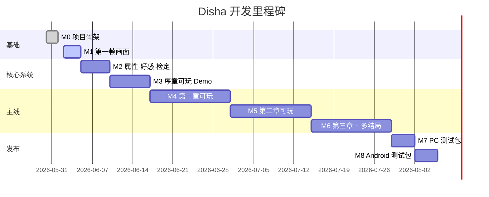

# 工作流与里程碑

> **状态**：当前生效版本（2026-06-01 制定）
> **关联文档**：[01-平台与分辨率](./01-平台与分辨率.md) · [02-玩法范围与边界](./02-玩法范围与边界.md) · [03-技术栈与架构](./03-技术栈与架构.md) · [04-属性·好感·检定系统设计](./04-属性·好感·检定系统设计.md)
> **目的**：把"想法"变成可执行的任务清单，每个任务都有验收标准和依赖关系。

---

## 一、当前状态盘点（2026-06-01）

### 1.1 ✅ 已完成

| 项目 | 状态 |
|------|------|
| Godot 项目骨架（5 场景 + 5 Autoload） | ✅ |
| Dialogic 2 插件安装 | ✅ |
| 平台/分辨率/触屏热区配置（见 01 文档） | ✅ |
| 全局 Theme 资源占位 | ✅ |
| 测试时间线 `data/timelines/test.dtl` | ✅ |
| 文档体系初版（01~05） | ✅（你正在看的这五篇） |

### 1.2 🟡 进行中

| 项目 | 状态 |
|------|------|
| 思源宋体接入 | 🟡（README 已写，文件未放）|
| Android Build Template 安装 | 🟡 |

### 1.3 🔴 未开始（按下表里程碑推进）

见 §2~§4。

---

## 二、里程碑总览



| 里程碑 | 名称 | 验收 | 预估 |
|-------|------|------|------|
| **M0** | 项目骨架 | 5 场景 + 5 Autoload + Dialogic 装好；可运行无报错 | ✅ 已完成 |
| **M1** | 第一帧画面 | TitleScreen → DialogueScene 走通；播放 1 行对白 | 2~3 天 |
| **M2** | 三系统接入 | 属性/好感/检定 API 可用；测试时间线能跑门槛选项 | 5 天 |
| **M3** | 序章 Demo | 序章剧本完整可玩；含必败战 CG 演出 + 教学 toast | 7 天 |
| **M4** | 第一章 | 越州城调查 → 画皮鬼战；含燕行烈夜战分支 | 14 天 |
| **M5** | 第二章 | 千佛寺线 + 京城遗信 | 14 天 |
| **M6** | 第三章 + 多结局 | 盛唐幻境 + 3 个主结局 | 14 天 |
| **M7** | PC 测试包 | Windows 导出包，朋友试玩 | 4 天 |
| **M8** | Android 测试包 | APK 安装包；真机横屏 + 安全区验证 | 4 天 |

---

## 三、M1 任务清单（最近要做的，详细到能动手）

### 任务 #1：让 TitleScreen 能进入 DialogueScene

**目标**：玩家点击"开始游戏" → 跳转到 DialogueScene 并自动播放 `test.dtl`。

**做的事**：
1. 检查 `scripts/ui/TitleScreen.gd` 的"开始游戏"按钮回调是否调了 `EventBus.request_scene_change.emit(...)`
2. 检查 `scripts/ui/Main.gd` 是否监听并切换场景
3. 检查 `scripts/ui/DialogueScene.gd` 的 `_ready()` 是否调用了 `Dialogic.start("test")`

**验收**：F5 运行 → 标题界面 → 点开始 → 看到 `test.dtl` 的第一行台词。

---

### 任务 #2：DialogueScene 接入 Dialogic 默认 Layout

**目标**：使用 Dialogic 内置的对话框 + 立绘容器，避免从零造轮子。

**做的事**：
1. 在 DialogueScene.tscn 中加一个 `DialogicNode_DialogText` 子节点（或改用 Dialogic 提供的 LayoutScene）
2. 确认 `Dialogic.start()` 调用后画面有显示
3. 监听 `Dialogic.timeline_ended` → emit `EventBus.dialogue_finished` → 返回 TitleScreen

**验收**：在 DialogueScene 看到 Dialogic 的默认对话框样式；点击推进；结束后回到 TitleScreen。

---

### 任务 #3：把 Dialogic 的 dialogue_finished 接进 EventBus

**目标**：消除 EventBus 13 条 unused signal warning 中与对话相关的几条。

**做的事**：
```gdscript
# DialogueScene.gd 的 _ready()
Dialogic.timeline_ended.connect(_on_timeline_ended)

func _on_timeline_ended() -> void:
    EventBus.dialogue_finished.emit(GameState.current_dialogue_id)
    EventBus.request_scene_change.emit("res://scenes/title/TitleScreen.tscn")
```

**验收**：运行时 timeline 结束后正确触发 toast 或场景跳转。

---

### 任务 #4：写 M1 的"试金石"时间线

**目标**：替换 `data/timelines/test.dtl`，让它包含**最简单的一段序章开场**。

**内容（拟）**：
```
[旁白]：风穿过破败的牌坊。
[旁白]：你睁开眼，发现自己倒在一个陌生村落的泥地上。
[老道士进场]
老道士："醒了？小友，你身上有黄皮书的气息。"
[选项]
  ▸ "你怎么知道？"
  ▸ "你是谁？"
[end]
```

**注**：这一版还**不接入**属性/好感/检定，只是"最小可玩"。属性接入留到 M2。

**验收**：在 Dialogic Editor 里能正常打开；运行时按预期播放。

---

## 四、M2 任务清单（在 M1 之后做）

### 任务 #5：建 `AttributeSystem.gd`

参考 04 文档 §2.5。
**验收**：在 Dialogic 时间线里写 `[call AttributeSystem.add("attr_wuli", 1)]` 能正常执行并弹 toast。

### 任务 #6：建 `AffinitySystem.gd`

参考 04 文档 §3.4。
**验收**：能写读 `affinity_<npc>` 数值；clamp 在 0~100。

### 任务 #7：建 `RequirementChecker.gd`

参考 04 文档 §4.5。
**关键**：用 Godot 的 `Expression` 类做表达式求值，支持 `&&` `||` `>=` 等操作符。
**验收**：单元测试覆盖 5 种条件类型（属性、好感、Flag真、Flag假、复合）。

### 任务 #8：改造 Dialogic Choice Layout

**目标**：让不满足条件的选项**显示为灰色但可见**（默认 Dialogic 是隐藏）。

**做的事**：
- 复制 `addons/dialogic/Modules/Choice/` 里的默认 ChoiceButton 到 `resources/dialogues/choice_layouts/`
- 自定义 `_ready()`：如果 `condition` 不满足，设置按钮 disabled 但保持可见
- 在 Dialogic 设置中切换 Layout

**验收**：测试时间线里有 3 个选项（一个无门槛、一个属性达标、一个不达标）→ 不达标的显示灰色不可点。

### 任务 #9：M2 验证时间线

**内容**：在 test.dtl 末尾加一段：
```
[选项]
  ▸ 拔剑（需要 attr_wuli ≥ 1）
  ▸ 闪开
[选玩家点"闪开"分支]
[call AttributeSystem.add("attr_zhilue", 1)]
[end]
```

**验收**：第一次玩武力为 0 选项灰色；闪开后智略+1 toast 弹出。

---

## 五、M3 任务清单（序章 Demo）

> ⚠️ **不要急着开始 M3**，必须先把 M1 + M2 跑通。

### 任务 #10：序章 5 段时间线

按 `世界观/05-序章小说式描述.md` 拆成 5 段：
1. `prologue_01_arrival.dtl`：穿越 + 倒地醒来
2. `prologue_02_village.dtl`：村民对话 + 黄皮书觉醒
3. `prologue_03_master.dtl`：老道士登场 + 教学
4. `prologue_04_combat.dtl`：画皮鬼出现 + 必败战 CG 演出
5. `prologue_05_indication.dtl`：导师指引去越州城

### 任务 #11：必败战 CG 演出

**做法**：用 Dialogic 的 Background 模块切 CG + Text 旁白讲述战斗，**不实现战斗系统**（参见 02 文档 §5.2）。

### 任务 #12：黄皮书 HUD

新建 `scripts/ui/HuangBookHud.gd`，监听 `EventBus.story_node_unlocked` 显示当前章节目标。

### 任务 #13：序章存档点

序章结束 → 自动写入 `slot_auto`（已由 SaveSystem 在 dialogue_finished 时处理）。

---

## 六、Dialogic 时间线编写规约（给写剧本的人）

### 6.1 命名

| 项目 | 规则 | 例 |
|------|------|----|
| Timeline 文件 | `<章节>_<序号>_<主题>.dtl` | `ch01_03_yan_first_meet.dtl` |
| Character 文件 | `<角色 ID>.dch` | `yan_xinglie.dch` |
| 变量引用 | `{attr_xxx}` / `{affinity_xxx}` | `{attr_wuli}` |
| Flag 引用 | 通过 `RequirementChecker.check("flag:xxx")` 间接调用 | — |

### 6.2 必备元素

每段时间线必须包含：
- 开头：`[label start]`（方便 Jump 跳回）
- 选项：每个选择点至少 2 个分支
- 结尾：`[end]` 或 `[jump <next_timeline>]`

### 6.3 禁忌

- ❌ 不要在 Dialogic 里写复杂逻辑（用 `[call SystemName.func()]` 调出去）
- ❌ 不要直接写 `EventBus.xxx.emit(...)`（应该走子系统封装）
- ❌ 不要在多个 timeline 里复制粘贴选项条件——共用条件请在 GameState 里提个统一变量

---

## 七、合作分工建议（如果未来有人加入）

| 角色 | 文件归属 | 不要碰的地方 |
|------|---------|-------------|
| **剧情策划** | `data/timelines/*.dtl` + `资源/dialogues/*.dch` | `scripts/`、`addons/` |
| **UI/美术** | `resources/`、`scenes/*.tscn` 的视觉部分 | `scripts/autoload/` |
| **程序** | `scripts/` 全部 | `data/timelines/*.dtl` 的内容 |
| **PM** | `docs/` | `addons/dialogic/`（永远不动）|

---

## 八、风险与未决事项

| 风险 | 影响 | 缓解 |
|------|------|------|
| 思源宋体未到位 | 中文字号/排版可能微调 | M1 之后追加任务 |
| Android Build Template 未装 | 不能出 APK | M7 前必须解决 |
| Dialogic Choice Layout 改造复杂 | 任务 #8 可能超期 | 预留 1 天缓冲 |
| 剧本字数评估 | 完整版可能超 8 万字 | M3 完成后做总量评估 |

| 未决项 | 待你拍板时机 |
|-------|-------------|
| 思源宋体 vs 其他字体 | M1 完成后 |
| 是否要立绘动画（Spine / Live2D） | M3 完成后看效果 |
| 配音是否做 | M6 完成后 |
| 隐藏结局数量 | M5 完成后 |

---

## 九、变更日志

| 日期 | 版本 | 变更 |
|------|------|------|
| 2026-06-01 | v1.0 | 初版：从 M0 到 M8 的完整路线图 |
